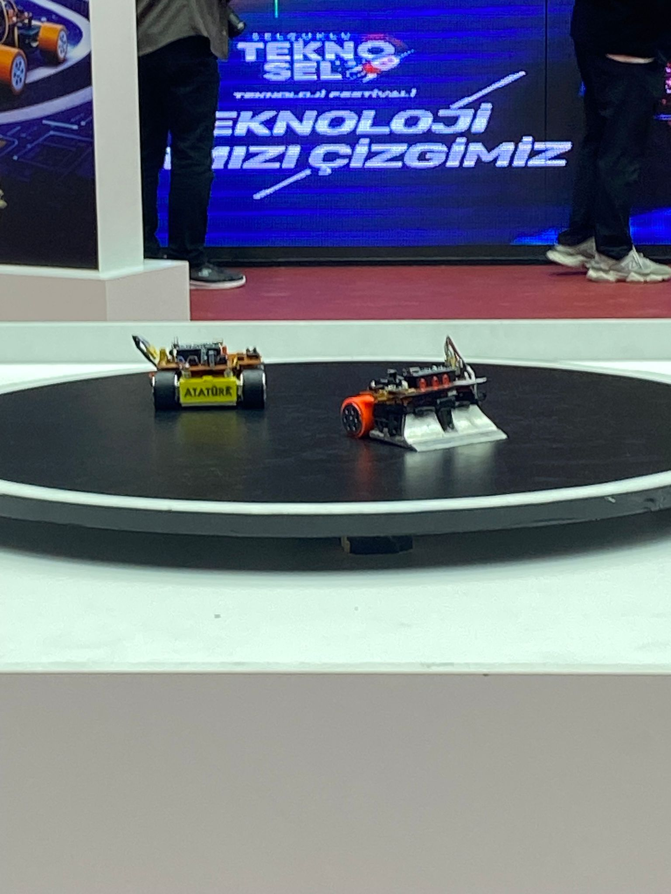
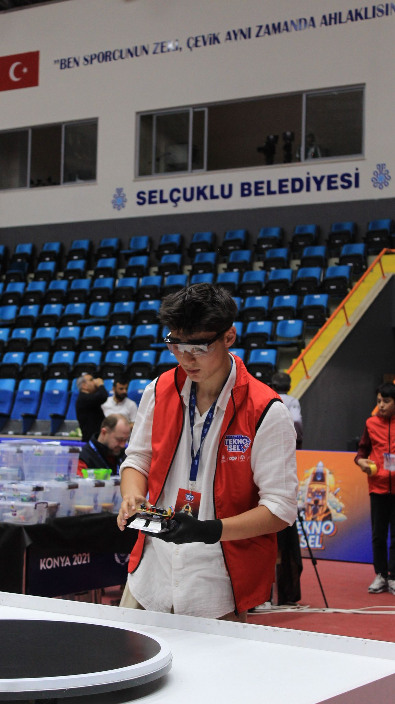
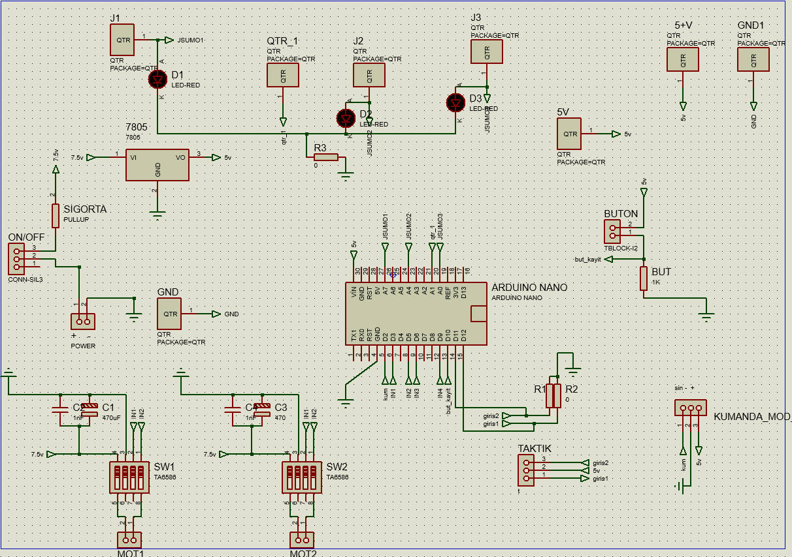
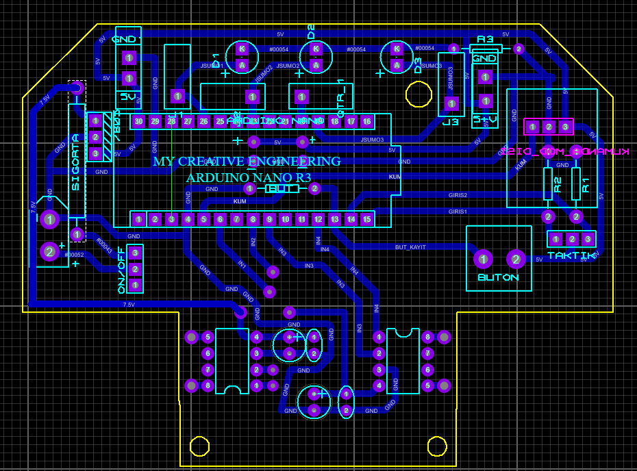
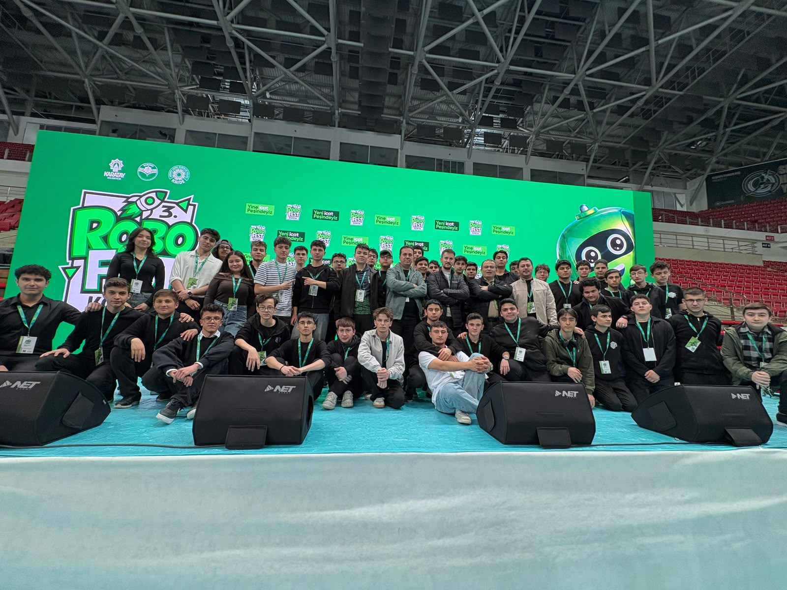

# 🤖 Mini Sumo Robot — Arduino Nano

<p align="center">
  
  
</p>

<p align="center">
  <b>Arduino Nano tabanlı, TA6586 sürücülü, JSUMO sensörlü yarışma sınıfı mini sumo robotu</b><br/>
  <sub>Robofest & Selçuklu Teknosel Teknoloji Festivali'nde yarışmıştır 🏆</sub>
</p>

<p align="center">
  
  
  
  
  
</p>

---

## 📋 İçindekiler
- [Genel Bakış](#-genel-bakış)
- [Özellikler](#-özellikler)
- [Malzeme Listesi (BOM)](#-malzeme-listesi-bom)
- [Devre Şeması & PCB](#-devre-şeması--pcb)
- [Pin Bağlantı Tablosu](#-pin-bağlantı-tablosu)
- [Çalışma Mantığı](#-çalışma-mantığı)
- [Kurulum & Yükleme](#-kurulum--yükleme)
- [Kalibrasyon](#-kalibrasyon)
- [Yarışma Geçmişi](#-yarışma-geçmişi)
- [Lisans](#-lisans)

---

## 🎯 Genel Bakış

Bu proje, **mini sumo** kategorisi için tasarlanmış tam otonom bir savaş robotudur.
Amaç: siyah dairesel ringde rakibi tespit edip iterek ring dışına çıkarmak, kendisi ise
beyaz sınır çizgisini algılayıp ring içinde kalmaktır.

Beyin olarak **Arduino Nano (ATmega328P)** kullanır. İki adet **9V 600 RPM Novamax redüktörlü DC motor**,
**TA6586** çift kanal motor sürücüleri ile sürülür. Rakip tespiti **3 adet JSUMO IR mesafe sensörü**,
ring sınırı ise **QTR kenar sensörü** ile yapılır. Maç, kurallara uygun olarak
**MEB / Mikro Start modülü** ile başlatılır.

---

## ✨ Özellikler

- 🧠 **Arduino Nano** kontrolcü — kompakt ve yeniden programlanabilir
- ⚡ **Çift TA6586 motor sürücü** — her motor için bağımsız yön/hız (PWM) kontrolü
- 🏎️ **9V 600 RPM Novamax** yüksek torklu redüktörlü motorlar
- 👀 **3× JSUMO IR sensör** (sol / orta / sağ) ile geniş açılı rakip tarama
- 🛑 **QTR kenar sensörü** ile beyaz sınır algılama → ringden düşmeyi önler
- 🚦 **MEB / Mikro Start modülü** desteği — kurallara uygun maç başlatma
- 🎛️ **TAKTIK jumper** ile maç öncesi strateji (arama yönü) seçimi
- 🔘 **Kayıt / mod butonu** ve durum **LED**'leri
- 🔋 **7805 regülatör + sigorta + ON/OFF anahtar** ile korumalı güç hattı
- 🖥️ **Proteus** ile tasarlanmış özel PCB

---

## 🧰 Malzeme Listesi (BOM)

| # | Malzeme | Adet | Açıklama / Referans |
|---|---------|:----:|---------------------|
| 1 | **Arduino Nano (ATmega328P)** | 1 | Ana kontrolcü |
| 2 | **TA6586 Motor Sürücü** | 2 | Çift kanal DC motor sürücü (SW1, SW2) |
| 3 | **9V 600 RPM Novamax Redüktörlü DC Motor** | 2 | Tahrik motorları (MOT1, MOT2) |
| 4 | **JSUMO IR Mesafe Sensörü** | 3 | Rakip tespiti (JSUMO1 / JSUMO2 / JSUMO3) |
| 5 | **QTR Kenar (Çizgi) Sensörü** | 1 | Ring beyaz sınır algılama (qtr_1) |
| 6 | **MEB / Mikro Start Modülü** | 1 | Maç başlatma sinyali (kum) |
| 7 | **7805 Voltaj Regülatörü** | 1 | 7.5V → 5V lojik besleme |
| 8 | **Elektrolitik Kondansatör 470µF** | 2 | Motor besleme filtreleme (C1, C3) |
| 9 | **Kondansatör 1nF** | 2 | Motor gürültü bastırma (C2, C4) |
| 10 | **LED (Kırmızı)** | 3 | Durum göstergeleri (D1, D2, D3) |
| 11 | **Direnç 1kΩ** | 1 | Buton pull-down (BUT) |
| 12 | **Direnç (0Ω / köprü)** | 3 | R1, R2, R3 (jumper) |
| 13 | **Push Buton** | 1 | Kayıt / mod butonu (BUTON) |
| 14 | **3'lü Header (TAKTIK)** | 1 | Strateji seçim jumper'ı (giris1/giris2) |
| 15 | **Kumanda Modülü Bağlantısı** | 1 | KUMANDA_MOD (opsiyonel) |
| 16 | **ON/OFF Anahtar (CONN-SIL3)** | 1 | Güç açma/kapama |
| 17 | **Sigorta (PULLUP)** | 1 | Aşırı akım koruması |
| 18 | **Pil / Batarya Paketi** | 1 | 2S LiPo (7.4–7.5V sınıfı) |
| 19 | **Özel PCB** | 1 | Proteus tasarımı (bu depo) |
| 20 | Tekerlek + lastik, şasi, vidalar | — | Mekanik montaj |

> ⚠️ **Not:** Mini sumo yönetmeliğine göre robot en fazla **10×10 cm** ve **500 g** olmalıdır.
> Motor/pil seçiminizi bu limitlere göre doğrulayın.

---

## 🔌 Devre Şeması & PCB

| Şema (Schematic) | PCB Layout |
|:---:|:---:|
|  |  |

Tasarım **Proteus** ortamında yapılmıştır. Güç hattı: **Pil → Sigorta → ON/OFF → 7805 → 5V lojik**.
Motorlar doğrudan pil (~7.5V) ile beslenir; kondansatörler (470µF + 1nF) motor gürültüsünü bastırır.

---

## 📍 Pin Bağlantı Tablosu

> Aşağıdaki pin atamaları **`src/mini_sumo.ino`** dosyasındaki `PIN AYARLARI` bloğuyla birebir eşleşir.
> Kendi kartınızda farklı ise **yalnızca o bloğu** düzenlemeniz yeterlidir.

### Sensör & Giriş

| İşlev | Net Adı | Arduino Pini |
|-------|---------|:------------:|
| Sol IR sensör | `JSUMO1` | `A7` |
| Orta IR sensör | `JSUMO2` | `A6` |
| Sağ IR sensör | `JSUMO3` | `A5` |
| Kenar (QTR) sensör | `qtr_1` | `A0` |
| Start modülü | `kum` | `D2` |
| Taktik jumper 1 | `giris1` | `D11` |
| Taktik jumper 2 | `giris2` | `D12` |
| Kayıt/mod butonu | `but_kayit` | `D10` |

### Motor Sürücü (TA6586)

| İşlev | Net Adı | Arduino Pini | Sürücü |
|-------|---------|:------------:|:------:|
| Sol motor + | `IN1` | `D3` (PWM) | SW1 |
| Sol motor − | `IN2` | `D5` (PWM) | SW1 |
| Sağ motor + | `IN3` | `D6` (PWM) | SW2 |
| Sağ motor − | `IN4` | `D9` (PWM) | SW2 |

---

## 🧠 Çalışma Mantığı

```
        ┌─────────────────────────────┐
        │   START modülü sinyali bekle │
        └──────────────┬──────────────┘
                       ▼
        ┌─────────────────────────────┐
        │  Kenar (beyaz sınır) var mı? │──Evet──► Geri çekil + ters yöne dön
        └──────────────┬──────────────┘
                       │ Hayır
                       ▼
        ┌─────────────────────────────┐
        │      Rakip tespiti (IR)      │
        ├─────────────────────────────┤
        │ Orta/İkisi → TAM GAZ SALDIR  │
        │ Sadece Sol → Sola yönel      │
        │ Sadece Sağ → Sağa yönel      │
        │ Rakip yok  → Taktiğe göre ara│
        └─────────────────────────────┘
```

- **Kenar önceliklidir:** QTR beyaz sınırı görürse robot her şeyi bırakıp içeri kaçar → ringden düşmeyi engeller.
- **Rakip bulununca:** en yakın yöne dönüp tam gazla iter.
- **Rakip yokken:** `TAKTIK` jumper'ına göre sola/sağa tarar veya düz ilerler.

---

## 🚀 Kurulum & Yükleme

1. **Arduino IDE**'yi kurun (1.8+ veya 2.x).
2. Bu depoyu klonlayın:
   ```bash
   git clone https://github.com/<kullanici-adin>/mini-sumo-robot.git
   ```
3. `src/mini_sumo.ino` dosyasını Arduino IDE ile açın.
4. **Kart:** `Tools → Board → Arduino Nano`
5. **İşlemci:** `Tools → Processor → ATmega328P` *(eski bootloader ise "Old Bootloader" seçin)*
6. Doğru **COM portunu** seçip **Upload** edin.

> Farklı pin bağladıysanız `.ino` içindeki **`PIN AYARLARI`** bloğunu güncellemeniz yeterli.

---

## 🎚️ Kalibrasyon

- **QTR eşiği (`QTR_ESIK`):** Robotu ring zeminine koyun, QTR analog değerini okuyun.
  Siyah zemin düşük, beyaz sınır yüksek değer verir; eşiği ikisinin **ortasına** ayarlayın.
- **Motor yönü:** Robot geri gidiyorsa ilgili motorun `IN` pin sırasını (veya kablo uçlarını) ters çevirin.
- **Hız sabitleri:** `HIZ_ATAK`, `HIZ_ARAMA`, `HIZ_DONUS` değerlerini pil ve motor performansına göre ayarlayın.

---

## 🏆 Yarışma Geçmişi

Bu robot çeşitli teknoloji festivali ve robot yarışmalarında sahne aldı:

<p align="center">
  
</p>

- 🥇 **3. Robofest Konya** — Karatay Belediyesi
- 🤖 **Selçuklu Teknosel Teknoloji Festivali** — Konya

---

## 📄 Lisans

Bu proje **MIT Lisansı** ile lisanslanmıştır. Dilediğiniz gibi kullanabilir, geliştirebilir ve paylaşabilirsiniz.

---

<p align="center">
  <sub>🛠️ Tasarım & Kod • Mini Sumo Robotics • Made in Konya 🇹🇷</sub>
</p>
